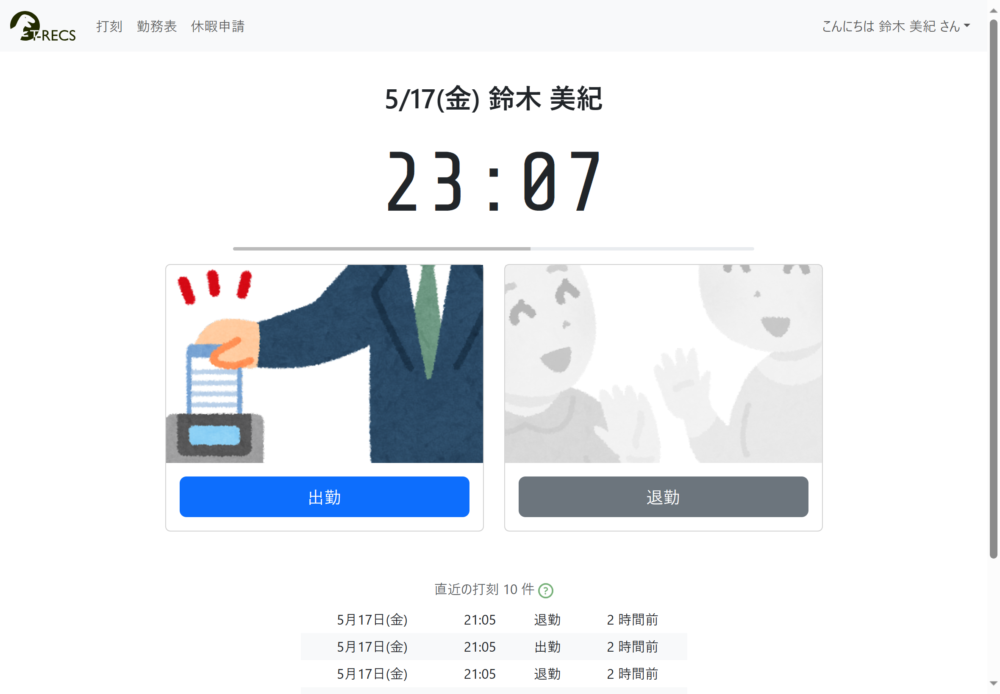

[English](README.md) | [日本語](README-ja.md)

# django-web-timecard


Web based simple Time Card system written by django. Currently this application only supports Japanese and Japan holidays.

## Features
User can clock in and clock out from a smartphone or PC. Manager check users time records.



## Usage

### Time recording
- Click button for "attendance at work" or "leaving work".
- When you see a message or hear a sound effect, it indicates that time recording has been completed successfully.
- If you click in multiple times on the same day, the work time is first click to last click.

### Monthly time records
- You can check monthly records and working hours.
- Manager can check all user's records.

### Change Password
- Users can change own password.

## Demo
- Access to [https://cottonspace.pythonanywhere.com/worktime/login/](https://cottonspace.pythonanywhere.com/worktime/login/).
- Location information feature is turned off for demonstration purposes.
- Those users can use the demo:
- Demo user passwords are initialized to the default once a day.

| id  | password | role |
| ------------- | ------------- | ------------- |
| demo1  | demodemo1  | employee |
| demo2  | demodemo2  | employee |
| manage  | manemane1  | manager |

## Installation

### Download and edit settings
- Clone or download the application source code.
- Copy local_settings_template.txt located in the django-web-timecard/timecard directory to the same directory as local_settings.py.
- Edit the part from % to % of the local_settings.py according to your environment.
- To recreate SECRET_KEY, please use [Random string generation tool](https://cottonspace.github.io/tools/generate-random-text.html).
- To set LOCATION_ORIGIN, please use the [Latitude and Longitude check tool](https://cottonspace.github.io/tools/select-lat-lng.html).
- If you do not know the database settings or want to test this application, please set DATABASES as follows.
```
DATABASES = {
    'default': {
        'ENGINE': 'django.db.backends.sqlite3',
        'NAME': Path(__file__).resolve().parent.parent / 'db.sqlite3',
    }
}
```
- You can easily create a local_settings.py file using the [django-web-timecard easy config tool](https://cottonspace.github.io/tools/django-web-timecard-local-settings.html).

### Initialize
- Run the following command in the django-web-timecard directory to prepare the database.
```
pip install -r requirements.txt
python3 manage.py migrate
```
- Create a superuser with the following command.
```
python3 manage.py createsuperuser
```
- Initialize the working hours for each day of the week with the following command. This will create default settings, so you can edit them later to create appropriate working hours rules.
```
python3 manage.py loaddata worktime/fixtures/standardworkpattern.json
```
- Start the server. For example, to start with Django's functions, run the following command.
```
python3 manage.py runserver
```

### Initial setting
- Log in as superuser in a web browser to access the administration screen.
- First, set the working time pattern for each day of the week on the "Work Pattern" screen. Be sure to perform this setting first before starting application operation.
- Use the following command to initialize the working hours for each day of the week and create a business day calendar.
```
python3 manage.py create_calendar
```
- Register the user who will be stamping the time by adding users as appropriate from the management screen.

### Adding commands to tasks
- Register the following command to be executed at least once a month in a regular task such as crontab.
```
python3 manage.py create_calendar
```

### Delete business day calendar
- If you want to reconfigure the business day calendar created with `create_calendar`, you can use the command below to delete the business day calendar for the specified month and beyond months.
```
python3 manage.py delete_calendar year month
```
- The missing month's business day calendar will be recreated by running `create_calendar`.
- Business day calendars are managed on a monthly basis, so it is not possible to delete only specific days within a month.

### Disabling a user
- If you want to disable a user due to retirement, etc., we recommend unchecking the user's "enabled" checkbox on the administrator screen. If you delete it, you will no longer be able to view that user's past attendance history.
- Users whose "Enabled" checkbox is unchecked will be displayed with a "*" symbol after their "Name" when displayed in a list.

## License
[MIT](LICENSE)
